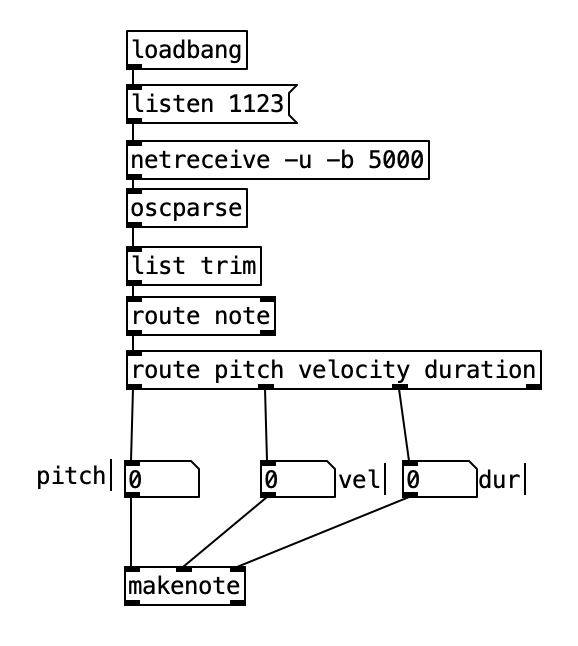

# Python to Pd Communication 

In this exercise, we will implement a random note generator/sequencer in python, from which generated notes are sent to pd for playback at random time intervals. 

    
    number_of_note_to_gen = 1000

    for ix in range(number_of_note_to_gen):
        # Generate pitch velocity and duration
        pitch = int(random.randrange(40, 64))
        velocity = int(random.randrange(10, 127))
        duration = int(random.randrange(0, 1000))

        #Send to pd
         ...
        
        # wait for some time then generate next note
        wait_time_before_next_note = random.randrange(1, 10)/30    # this is basically IOI (inter-onset interval)
        time.sleep(wait_time_before_next_note)  
        

Sending data out of Python
----- 

To send data out of pd, we will again use the **pythonosc** library. Specifically, we will use the **SimpleUDPClient** to establish the udp connection with pd.

    from pythonosc.udp_client import SimpleUDPClient
    
    ip='127.0.0.1'
    sending_to_port=1123
    py_to_pd_OscSender = SimpleUDPClient(ip, sending_to_port)
    
Then, we will use the **send_message(osc_address, value)** to send out the generated data. 

        py_to_pd_OscSender.send_message("/note/velocity", velocity)
        py_to_pd_OscSender.send_message("/note/duration", duration)
        py_to_pd_OscSender.send_message("/note/pitch", pitch)

Receiving data in pd
------
We will use the **[netreceive ...]** method to receive OSC messages.

The received data can be routed to their correct destinations using the **[route ...]** method in pd.
 
