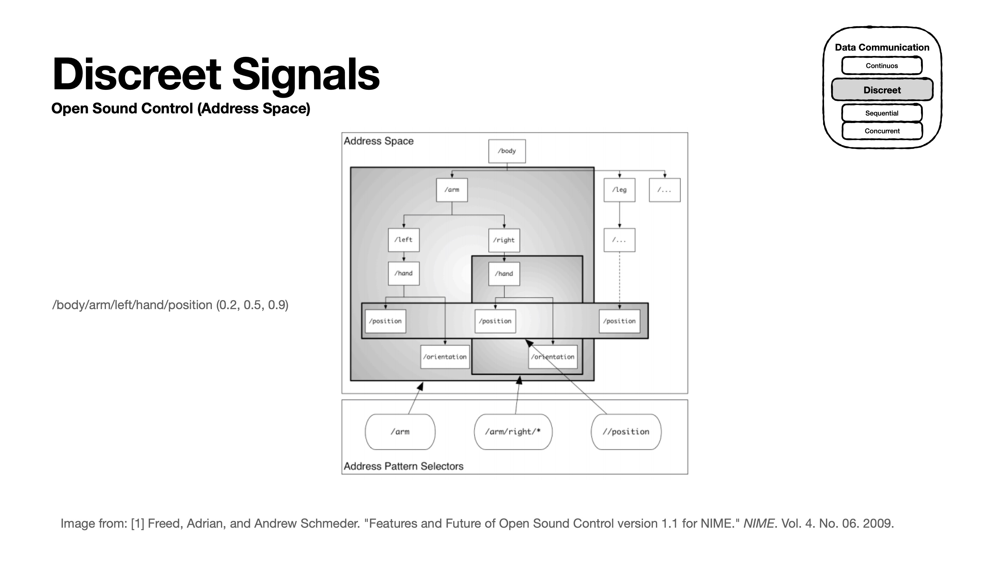

# Python <--> Pd Communication 

In this lab we will discuss how to use OSC protocol for easily communicating between python and pd! 

The are three examples in this lab:
- **Example A**:  Pd to Python communication 
- **Example A**:  Python to Pd communication 
- **Example A**:  Two-way communication 

For each example, refer to the corresponding sub-directory 

 

 
 
 
